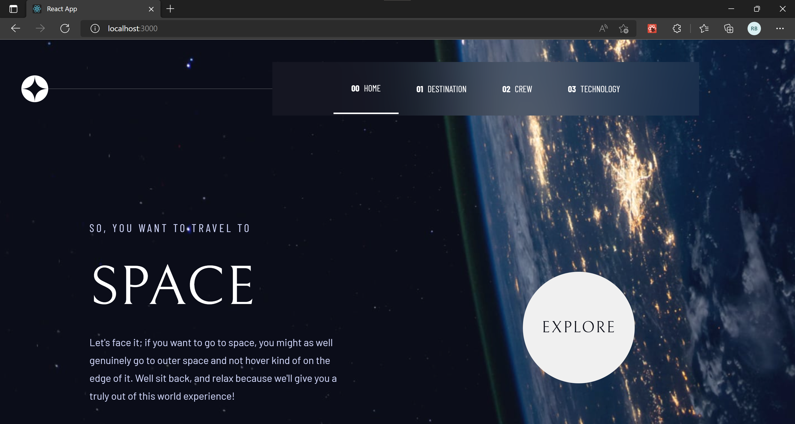

# Space Tourism Website - ReactJS, React Router, Hooks, CSS3, Flexbox
 
 It's a multi-page space tourism website. A Figma design conversion to react app.

 ### Desktop View
 

### Links

- Solution: [Code](https://github.com/rimshub/react-space-tourism-website/tree/main/src)
- For Live Site: [Space tourism website](https://react-space-tourism-website-alpha.vercel.app/)

### Built with

- [React](https://reactjs.org/) - JS library
- React Router, Hooks
- CSS3
- Flexbox
- Desktop-first workflow

### Useful resources

- [React Router](https://v5.reactrouter.com/web/guides/quick-start) - This is helpful guide on how to use react router with multiple examples
- [CSS Tricks](https://css-tricks.com/) - Very helpful whenever got stuck at styling
 
## Author

- Website - [Rimsha](https://github.com/rimshub)
- Frontend Mentor - [@rimshub](https://www.frontendmentor.io/profile/rimshub)

### Ack
### Frontend Mentor - Space tourism website solution

This is a solution to the [Space tourism website challenge on Frontend Mentor](https://www.frontendmentor.io/challenges/space-tourism-multipage-website-gRWj1URZ3).
